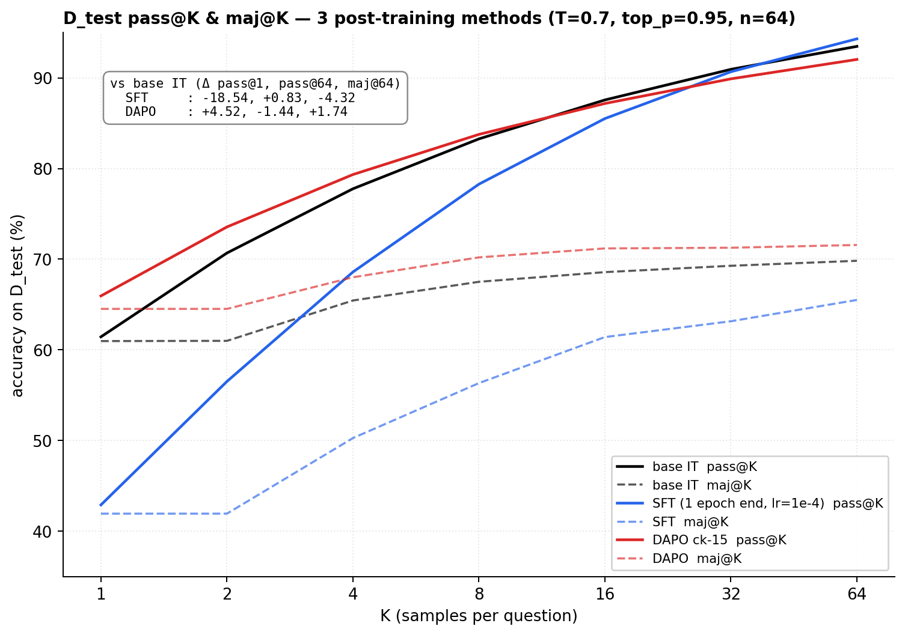

# gemma-math-sft-grpo

A hands-on study of classic **post-training algorithms** on a small instruct model,
holding **model + data + eval constant** and varying only the algorithm. The aim is
source-level understanding of the SFT → DPO → GRPO/DAPO pipeline (TRL / PEFT / verl /
vLLM internals) — a learning / interview-prep project.

> Model weights, datasets, and raw per-sample eval dumps are intentionally **not**
> committed — they're large and fully reproducible from the code here (see `SETUP.md`).

## Setup (held fixed across methods)
- **Base model:** `gemma-2-2b-it`
- **Tasks:** GSM8K + a 500-question numeric MATH slice (`math500_numeric` / `math500_aug`)
- **Eval:** DeepSeek-style 5-layer answer extraction + `math_equal`; pass@k / maj@k via vLLM (K up to 64–128)
- **LoRA:** r=64, α=32, all-linear, dropout=0
- **Hardware:** single RTX 5080 16 GB (SFT/eval, local) + cloud L40S/L20 (RL)

## Experiments
| Dir | What |
|---|---|
| `E1_baseline/` | base-model DS-CoT baseline + the shared eval harness (pass@k / maj@k) |
| `E2_sft/` | SFT on GSM8K gold; LR / checkpoint sweep + a top-down behavioural analysis (`FINDINGS.md`) |
| `E5_grpo/` | RL post-training with **verl**: **DAPO** (R15) and **GRPO** (R16), reward via a rule/judge function |
| `shared/` | shared answer-extraction / eval utilities |

Each experiment dir holds its code (`train/`, `eval/`, `tools/`), result figures
(`outputs/*.png`), and notes (`README.md` / `FINDINGS.md`). Per-run metrics are in
`outputs/eval_log.jsonl`.

## Results (headline)
Three methods on the GSM8K test set, pass@k + maj@k (K=64):



Verified anchors (from committed `eval_log.jsonl` / `CLAUDE.md`):

| Model | GSM8K (greedy, numeric) | MATH500 pass@1 (K=64) |
|---|---:|---:|
| base `gemma-2-2b-it` | 61.33% | 29.8% |
| DAPO (R15, ck-15) | — | 32.7% |

- **SFT** raises pass@K only marginally but **drops pass@1 ~1/3 and maj@K a few pp** — it
  concentrates probability on already-easy questions (full decomposition in
  `E2_sft/FINDINGS.md`).
- **DAPO/GRPO (RL)** recover single-shot accuracy and lift MATH500 pass@1 over base.
- Full pass@k / maj@k curves, mode-mass migration, and per-difficulty analysis: see the
  `outputs/*.png` figures in each experiment.

## Reproduce the environment (Docker)
Training and eval are separate images (vLLM's pins conflict with the TRL stack). The
verl RL env (E5) is documented separately in `docker/Dockerfile.grpo` /
`requirements-grpo.txt`.

```bash
# SFT / training
docker build -f docker/Dockerfile.train -t gemma-math:train .
docker run --gpus all -v $PWD/data:/workspace/data -v $PWD/models:/workspace/models -it gemma-math:train

# eval (vLLM pass@k / maj@k)
docker build -f docker/Dockerfile.eval -t gemma-math:eval .
docker run --gpus all -v $PWD/data:/workspace/data -v $PWD/models:/workspace/models -it gemma-math:eval
```
Or with conda/venv: `pip install -r requirements-train.txt` (+ `torch==2.10.0` from the
cu128 index, + `flash-attn==2.8.3`) and `pip install -r requirements-eval.txt`.
Pinned to Python 3.11 / CUDA 12.8 / torch 2.10; GPU needs sm_120 (CUDA 12.8+). Data and
the gated base model: see `SETUP.md`.

## Not in the repo (regenerate from code)
`*.safetensors` adapters, datasets (`data/`), and verbose per-sample eval JSON.

## License
MIT — see `LICENSE`.
