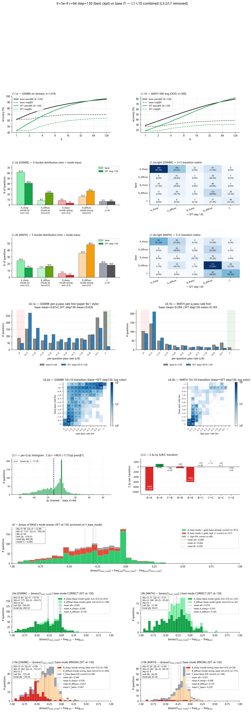
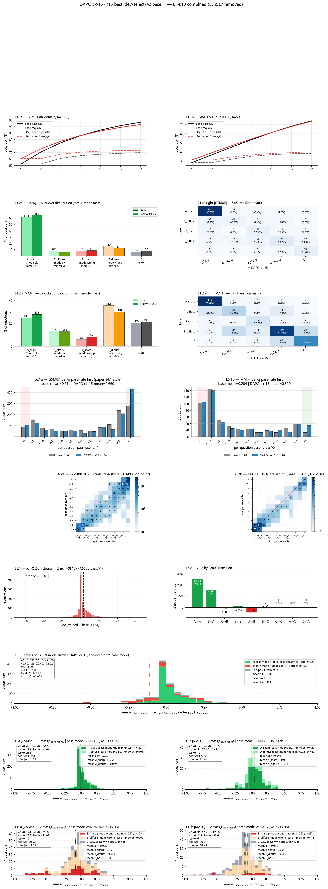
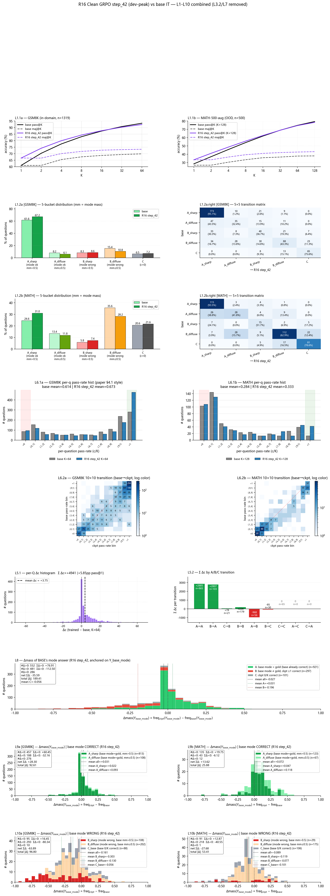
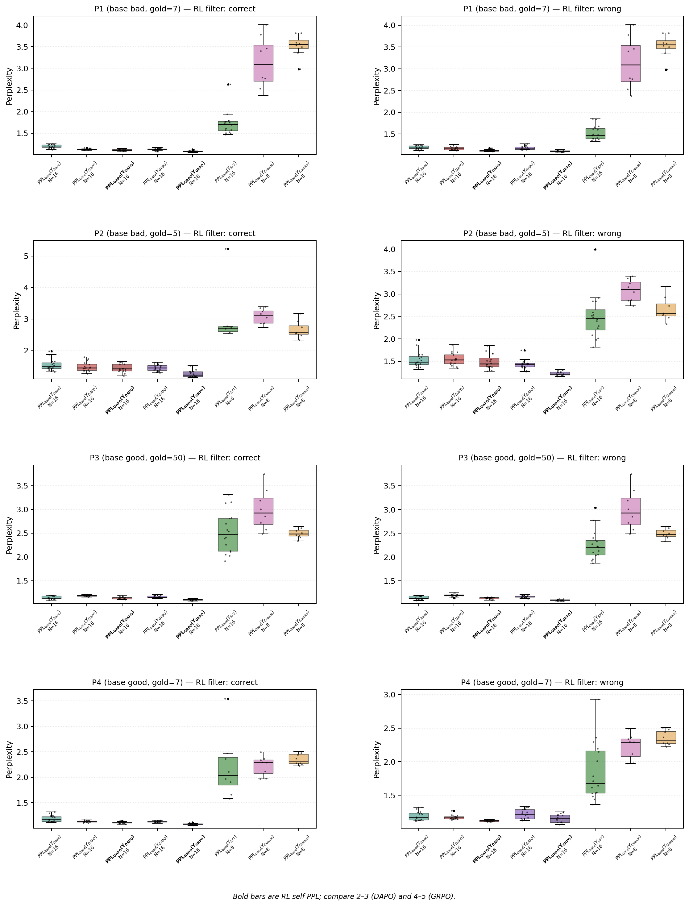

# RLVR 训练行为与推理分布诊断

> **Gemma-2-2B-IT · GSM8K · MATH-500-aug · SFT / DAPO / GRPO**
> An empirical replication and diagnostic study of *why RL works* in verifiable-reward reasoning.

受 [DeepSeekMath](https://arxiv.org/abs/2402.03300) 中 RL 后 `maj@K` 与 `pass@K` 变化不一致的现象启发，本项目追问：

> **RLVR 究竟扩大了模型可达的正确推理集合，还是主要重新分配了已有推理路径的概率质量？**

我在共享 Base 模型与评测链路上训练 SFT、DAPO 与 GRPO，不只比较最终准确率，还联合分析 `pass@K / maj@K`、题级状态迁移、难度分桶、答案主模态概率质量与同链 PPL。

## TL;DR

- **SFT 显著改变“会多少”与“多大概率答对”的关系：** GSM8K / MATH 的 `pass@1` 分别下降 **18.6 / 10.1 pp**，但 `pass@128` 反而上升 **1.5 / 2.6 pp**，同时 `maj@128` 下降 **6.1 / 7.4 pp**。
- **DAPO / GRPO 恢复并提升单次命中与多数投票，但未推高本实验的最大-K coverage：** 在可比 K 上，RL 的 `pass@K` 与 Base 持平或略低。
- **当前证据更支持 probability redistribution：** RL 把概率质量移向已存在的正确主模态，并压低错误主模态；PPL 诊断也表明 RL 链仍处在 Base 的高似然区域。
- **边界：** 这是 `Gemma-2-2B-IT + GSM8K + MATH-500-aug + 当前 checkpoint/seed` 下的经验结果；它不等于证明“RL 永远不会提升能力”。

## 核心结果

单元格内指标顺序为 **`pass@1 / pass@K / maj@K`**；`K` 是该实验实际报告的最大 K，不同方法不强行伪装成相同采样预算。

| 方法 | GSM8K 全量（n=1,319） | MATH-500-aug（n=500） |
|---|---:|---:|
| **Base** | K=128: **61.3 / 94.8 / 69.7%** | K=128: **28.4 / 79.4 / 38.0%** |
| **SFT** `lr=5e-4, ck130` | K=128: **42.8 / 96.4 / 63.6%** | K=128: **18.3 / 82.0 / 30.6%** |
| **DAPO** `R15, ck15` | K=64: **65.2 / 91.6 / 71.6%** | K=64: **31.0 / 73.7 / 40.0%** |
| **GRPO** `R16, step42` | K=64: **66.6 / 92.3 / 73.4%** | K=128: **33.3 / 78.4 / 43.1%** |

> **口径说明**
> - MATH-500-aug 是固定的 500 题数值可验证集：旧 `math500_numeric` 293 题 + 207 题补充 MATH 题，去重后无重复 problem。筛选依据是最终答案能否被规则判等，而非本次模型是否答对；本地 canonical JSONL 的 SHA-256 为 `c323818f84a46810de4f3afd40180b12786fe5bd6a7e9aac0b62e520c20db02d`。
> - DAPO MATH 底层由两个 K=64 采样池合并，combined 图仅报告到 `k=64`。
> - 横向比较应查看共同 `k≤64` 的完整曲线，不能只比较上表不同 K 的终点。DAPO 与 GRPO 的训练步数、seed 和超参不同，本项目不做二者的算法优劣排名。
> - 表中数字是 point estimate，当前未提供成对 bootstrap 显著性检验。按题目级最坏方差粗略估计，n=500 / 1,319 的 95% CI 半宽上限约为 4.4 / 2.7 pp，因此小差异只作描述性趋势。

## 证据 1：`pass@K` 与 `maj@K` 分化

`pass@K` 表示 K 次采样中至少一次正确，更接近有限采样下的“可达 coverage”；`maj@K` 表示多数答案是否正确，更敏感于概率质量集中在哪个答案模态。

- GSM8K 在 `k=64` 上：Base / DAPO / GRPO `pass@64 = 93.15 / 91.58 / 92.34%`
- MATH 上：Base / DAPO `pass@64 = 74.79 / 73.73%`；Base / GRPO `pass@128 = 79.40 / 78.40%`

因此，RL 的主要收益发生在 `pass@1` 与 `maj@K`，而非已观察 K 范围内的题集 coverage 扩张。

### 三组 combined dashboard

每张图在同一张 dashboard 中联系宏观 K 曲线、难度/状态迁移、per-question pass-rate 和 base-anchored mode mass。图像约 3k×8k，默认折叠以保持首页可读；点击图像可查看原分辨率。

<details>
<summary><strong>SFT — 高-K coverage 略升，但 pass@1 / maj@K 下降，呈现非选择性 distribution dilution</strong></summary>
<p align="center">
  <a href="v3/E2_sft/outputs/lr5e-4_step130_combined.png"></a>
</p>
<p align="center"><sub>Base vs SFT lr=5e-4 ck130；GSM8K n=1,319，MATH-500-aug n=500</sub></p>
</details>

<details open>
<summary><strong>DAPO — 正确主模态 +3.2 pp、错误主模态 −7.8 pp，收益主要来自概率重分配</strong></summary>
<p align="center">
  <a href="v3/E5_grpo/outputs/k64_dapo_ck15/dapo_ck15_combined.png"></a>
</p>
<p align="center"><sub>Base vs DAPO R15 ck15；combined 图报告到 K=64</sub></p>
</details>

<details>
<summary><strong>GRPO — 正确主模态 +3.1 pp、错误主模态 −16.1 pp，与 DAPO 同向的跨算法证据</strong></summary>
<p align="center">
  <a href="v3/E5_grpo/outputs/k64_r16_step42/r16_step42_combined.png"></a>
</p>
<p align="center"><sub>Base vs clean GRPO R16 step42；用作 robustness check，不与 DAPO 作算法排名</sub></p>
</details>

## 证据 2：题级迁移与答案主模态

我将题目按 Base 状态、难度和答案主模态分组，并跟踪每道题的 pass-rate 与 base-anchored mode mass 变化。

- SFT 不是简单学到一个稳定 wrong attractor；更符合 **distribution dilution**：原有答案模态被非选择性稀释，Easy 题受损最明显。
- DAPO / GRPO 对正确 base 主模态的平均概率质量分别提高约 **3.2 / 3.1 pp**，对错误主模态分别降低约 **7.8 / 16.1 pp**。
- 改善主要来自 Medium 区间；Easy 已接近饱和，Hard 题增益有限。

详细 SFT 分解见 [E2 FINDINGS](v3/E2_sft/FINDINGS.md)；RL 的迁移矩阵、难度桶和 mode-mass 图见 [E5 outputs](v3/E5_grpo/outputs/)。

## 证据 3：同链 PPL 诊断

<p align="center">
  <a href="v3/E5_grpo/outputs/yue_ppl_analysis/yue_8panel_selfppl.png"></a>
</p>
<p align="center"><sub>4 题 × 正误链的 same-chain PPL mechanism probe；点击查看原图</sub></p>

在 4 道选定题、按正误分组的同链评测中：

- `PPL_base(Y_DAPO)=1.182` vs `PPL_DAPO(Y_DAPO)=1.132`
- `PPL_base(Y_GRPO)=1.168` vs `PPL_GRPO(Y_GRPO)=1.103`
- Base 对外部 Claude / Gemini 推理链的 PPL 明显更高（聚合中位数 `2.819 / 2.540`）

这说明 RL 生成链对 Base 并不“奇怪”，为“RL 放大 Base 已有高似然行为”提供辅助证据。但 PPL 接近只能说明分布兼容，**不能单独证明 Base 能稳定生成同样的正确推理链**。该诊断只有 4 题，因此定位为 mechanism probe，而非统计性结论。

## 实验设置

| 项目 | 设置 |
|---|---|
| Base | `google/gemma-2-2b-it` |
| 任务 | GSM8K test 1,319 题（ID）；MATH-500-aug 500 题（OOD，数值可验证） |
| 方法 | SFT（TRL/PEFT）；DAPO / clean GRPO（verl） |
| LoRA | `r=64, alpha=32, all-linear, dropout=0` |
| 评测 | vLLM sampling；DeepSeek-style 5-layer extraction + `math_equal` |
| 本地硬件 | RTX 5080 16 GB（SFT / eval） |
| RL 硬件 | Cloud L40S / L20 |

## 证据与实现索引

| 方法 | 数据/训练入口 | 评测入口 | 分析脚本 | 主证据 |
|---|---|---|---|---|
| Base | [`SETUP.md`](SETUP.md) | [`03_eval_pass_at_k.py`](v3/E1_baseline/eval/03_eval_pass_at_k.py) | 共享 evaluator | [E1 README](v3/E1_baseline/README.md) |
| SFT | [`01_make_sft_data.py`](v3/E2_sft/data_gen/01_make_sft_data.py) · [`01_sft.py`](v3/E2_sft/train/01_sft.py) | 复用 E1 evaluator，LoRA rank 设为 64 | [`_plot_step130_combined.py`](v3/E2_sft/tools/_plot_step130_combined.py) | [combined](v3/E2_sft/outputs/lr5e-4_step130_combined.png) · [FINDINGS](v3/E2_sft/FINDINGS.md) |
| DAPO | [`run_dapo_r15.sh`](v3/E5_grpo/r15_dapo/run_dapo_r15.sh) · [`reward_judge_r15.py`](v3/E5_grpo/r15_dapo/reward_judge_r15.py) | [dev selection](v3/E5_grpo/eval/01_grpo_dev_eval.py) · E1 full evaluator | [`_plot_dapo_ck15_combined.py`](v3/E5_grpo/tools/_plot_dapo_ck15_combined.py) | [combined](v3/E5_grpo/outputs/k64_dapo_ck15/dapo_ck15_combined.png) |
| GRPO | [`run_grpo_r16_clean.sh`](v3/E5_grpo/r16_grpo_clean/run_grpo_r16_clean.sh) · [`reward_judge.py`](v3/E5_grpo/r16_grpo_clean/reward_judge.py) | [dev selection](v3/E5_grpo/eval/01_grpo_dev_eval.py) · E1 full evaluator | [`_plot_r16_combined.py`](v3/E5_grpo/tools/_plot_r16_combined.py) | [combined](v3/E5_grpo/outputs/k64_r16_step42/r16_step42_combined.png) · [E5 README](v3/E5_grpo/README.md) |

## 仓库导航

| 路径 | 内容 |
|---|---|
| [`v3/E1_baseline/`](v3/E1_baseline/) | Base 评测、pass@K / maj@K 与共享评测脚本 |
| [`v3/E2_sft/`](v3/E2_sft/) | SFT 训练、LR/checkpoint sweep 与 L1–L10 行为分析 |
| [`v3/E5_grpo/`](v3/E5_grpo/) | verl DAPO R15、GRPO R16、reward audit 与 RL 诊断 |
| [`v3/shared/`](v3/shared/) | 共享答案提取与判等工具 |
| [`SETUP.md`](SETUP.md) | 数据、模型与本地/容器环境准备 |

## 复现范围与环境

训练、评测与 verl RL 使用分离环境，避免 TRL / vLLM / verl 依赖锁冲突。

```bash
# SFT / training
docker build -f docker/Dockerfile.train -t gemma-math:train .

# vLLM evaluation
docker build -f docker/Dockerfile.eval -t gemma-math:eval .

# verl RL
docker build -f docker/Dockerfile.grpo -t gemma-math:grpo .
```

锁定环境：Python 3.11 / CUDA 12.8 / torch 2.10。详细命令和数据构建见 [`SETUP.md`](SETUP.md)。

### Clean clone 可复现性

| 层级 | 当前状态 |
|---|---|
| 环境构建 | Dockerfiles 与分离 requirements 已提交 |
| SFT 数据与训练 | 主入口已提交；需下载 Base 与 GSM8K，并将历史本地路径改为实际路径 |
| 共享评测 | chunk/resume evaluator 已提交；需准备数据、Base/LoRA 权重 |
| DAPO / GRPO 精确重跑 | launch 与 reward 代码已提交；云端绝对路径、RL parquet 与存储配置需在新环境重建 |
| combined 图精确重绘 | 图与分析代码已提交；需未入 Git 的大型 per-sample JSON，因此 clean clone 不能直接原样重绘 |

上表区分“代码/配置可审计”与“原实验可一键重跑”，避免对公开仓库的复现性作过度承诺。

## 结论边界

本项目是 **empirical replication + behavioral diagnosis**，不声称提出新 RL 算法，也不将 `pass@K` 直接等同于模型的绝对能力边界。当前限制包括：单一 Base 模型、RL 单 seed / 短训练、算法间训练预算不完全对齐、MATH 数值子集，以及有限 K 对低概率正确路径的漏检。

模型权重、checkpoint、数据集和大型 per-sample dump 未纳入 Git；仓库保留训练/评测代码、配置、精简日志和核心图表。

## License

[MIT](LICENSE)

